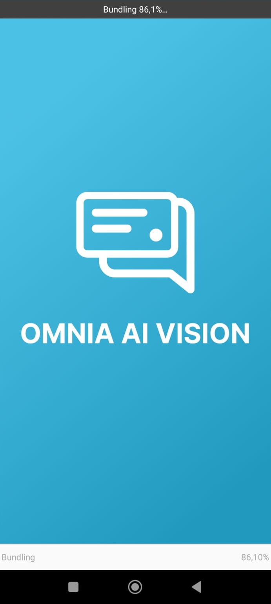
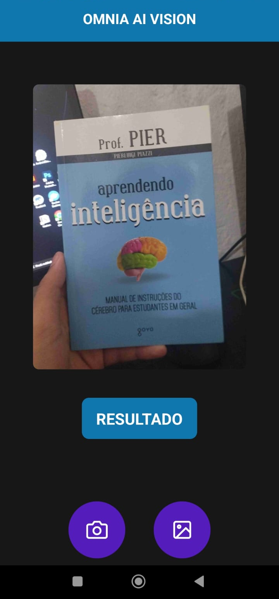
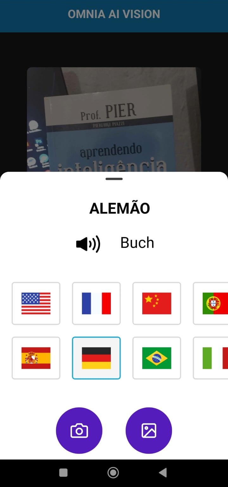
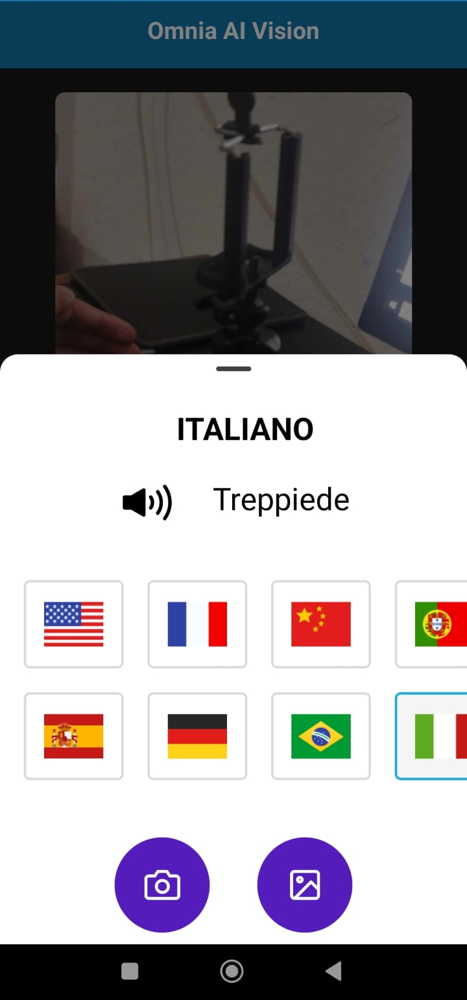
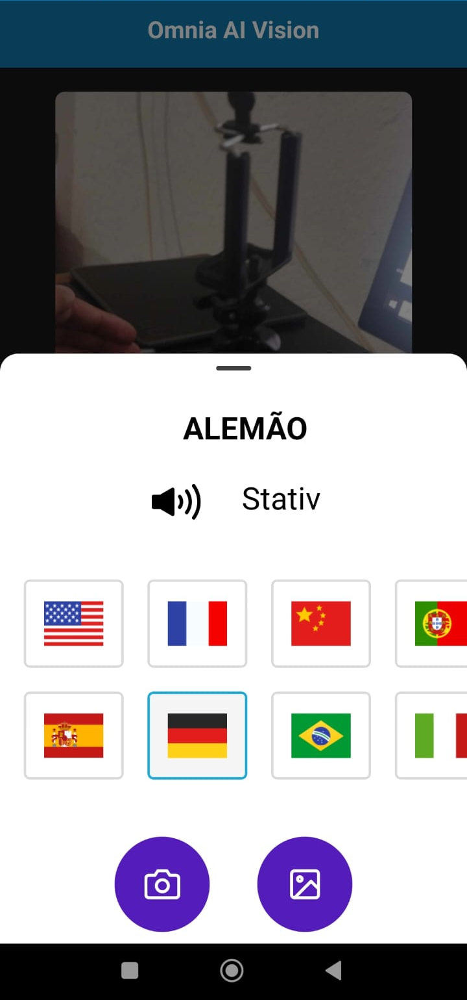

# Omnia AI Vision: Veja o mundo com novos olhos! 👁️🌎

<div>
  <p style="display: flex; align-items: center; gap: 20px; font-size: 24px;">
   
   Traduza objetos do mundo real instantaneamente com o poder da IA e expanda seus horizontes!
  <p>
<div>

## Imagens e video do aplicativo:

<div style="display: flex; gap: 20px; flex-wrap: wrap; margin-bottom: 20px;">
  
  <video src="./.github/video1.mp4" width="200" height="100%" controls></video>
  
  
  
  
  
</div>

Descubra um mundo de possibilidades com o aplicativo que traduz o mundo real através do poder da IA. Imagine apontar seu celular para qualquer objeto e instantaneamente descobrir não apenas o seu nome, mas também a sua tradução em diversos idiomas. Com o Omnia AI Vision, isso se torna realidade! Utilizando a avançada tecnologia do Gemini Pro Vision, nosso aplicativo identifica objetos em imagens e abre um portal para um novo nível de compreensão do mundo ao seu redor.

Experimente a magia da tradução visual:

- Explore o mundo sem barreiras: Uma ferramenta indispensável para viajantes, estudantes de idiomas e qualquer pessoa curiosa para desvendar o mundo.
- Amplie seus conhecimentos: Aprenda novas palavras em diversos idiomas e ouça a pronúncia correta, expandindo seus horizontes linguísticos.

## Recursos que você vai amar:

- Reconhecimento preciso de objetos: Capture uma imagem ou escolha da sua galeria e deixe a IA fazer a mágica.
- Traduções multilíngues: Acesse traduções em 17 idiomas, incluindo inglês, espanhol, francês, alemão, chinês, português-BR,português-PT, italiano, russo, japonês, coreano, árabe, hindi, turco, polonês, holandês e indonésio.
- Pronúncia em áudio: Aperfeiçoe sua pronúncia ouvindo a palavra em qualquer idioma.
- Interface intuitiva: Fácil de usar e navegar, para uma experiência agradável e intuitiva.

O Omnia AI Vision é mais do que um aplicativo, é uma janela para um mundo mais conectado e compreensível, veja o mundo com novos olhos! ✨

## Em Desenvolvimento 🚀

O Omnia AI Vision ainda é um protótipo que pode ganhar mais features e funcionalizades para torná-lo ainda mais completo, com mais telas e navegações e etc.

## Tecnologias Utilizadas

- **[React Native](http://facebook.github.io/react-native/)** com o **[Expo](https://expo.io/)**
- Gemini AI Pro Vision

### Pré-requisitos

- Você deve ter o **[Node.js](https://nodejs.org/en/)** instalado na sua máquina;
- Você deve ter o **[Git](https://git-scm.com/)** instalado e configurado no seu computador;
- Criar uma API Key em [Google AI Studio](https://aistudio.google.com/) para colocar no arquivo de variável de ambiente `.env`.
- Por fim, você precisa ter **[Expo Go](https://expo.dev/go)** instalado no dispositivo para emular o aplicativo.

## Variáveis de Ambiente

Antes de iniciar a aplicação, certifique-se de configurar as seguintes variáveis de ambiente:
Crie um arquivo na raiz do projeto chamado `.env` e veja o arquivo `.env.example` de modelo.

Insira sua Api Key do Gemini

```bash
EXPO_PUBLIC_GEMINI_API_KEY=
```

### Instalação

1. Faça o clone do repositório:

```bash
  $ git clone (https://github.com/Wallace-Bezerra/Omnia-AI-Vision)
```

2. Inicie o app:

```bash
  # Vá até o app
  $ cd Omnia-AI-Vision
  # Instale as dependências do projeto
  $ npm install
  # Inicie o app
  $ npm expo start
  # ou npx expo start
```

## Desenvolvido por:

### Wallace Bezerra

- [Linkedin](https://www.linkedin.com/in/wallace-bezerra/)
- [Portfolio](https://www.wallacebezerra.com/)
